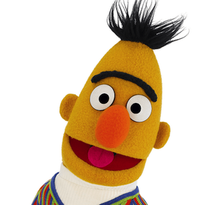
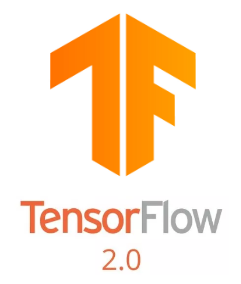
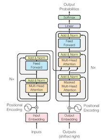

   

# NLP-Tasks
             
This repository provides links to colab notebooks that achieve high scores (~top 1%) in various NLP competitions using TensorFlow 2.0. All notebooks
can be run on Google colab in under 1 hour. 

## 1. Offensive Language Classification ([Notebook](https://colab.research.google.com/drive/1AstCNMK5_5MMKznrcKslUCFMCCNXk_ae))
This [Codalab competition](https://competitions.codalab.org/competitions/20011) asked us to classify social media posts
as offensive or not.  We [achieved](https://colab.research.google.com/drive/1AstCNMK5_5MMKznrcKslUCFMCCNXk_ae) scores that would have won the competition by simply following the following steps: 

* We replaced the many instances of the token "@USER" with generic name "Adam" so that the word embedding
will understand that "@USER" is referring to a name rather than tag it as an unknown symbol
* We plotted a histogram of sentence lengths so that we could set a max sentence length that did not effect too
many sentences. All sentences were then padded to this maximum length
* We used the Hugging Face package to download BERT and pre-process the sentences in a way that prepared them for BERT
* We initialised BERT with an extra final layer that classified between 2 classes
* We trained for 2 epochs using near default hyperparameters

## 2. Toxic Comment Classification ([Notebook](https://colab.research.google.com/drive/1tn5khO1arRJP__wU4O75k8FMj4KrWiVt))
This [Kaggle competition](https://www.kaggle.com/c/jigsaw-toxic-comment-classification-challenge/rules) asked us to classify
sentences as one of 6 classes of toxicity: toxic, severe toxic, obscene, threat, insult and identity hate. We 
[achieved](https://colab.research.google.com/drive/1tn5khO1arRJP__wU4O75k8FMj4KrWiVt) scores that would have 
put us in the top 1% of entries by simply following the following steps: 

* We set 30,000 as the max number of words in our vocabulary as this is typically enough
* We tokenized the dataset by associating each word found in the dataset with an index
* We downloaded the Glove embeddings and used them to produce an embedding matrix
* We created a GRU model that embedded the input data, applied spatial dropout, put it through a GRU layer,
applied global max and global average pooling to the result, and then finally put the output through a final linear layer
 to produce the classification
* Running this model for only 2 epochs was enough to get a score that would have put us in the top 1% of entries  

3rd could be Emo context... https://competitions.codalab.org/competitions/19790#learn_the_details